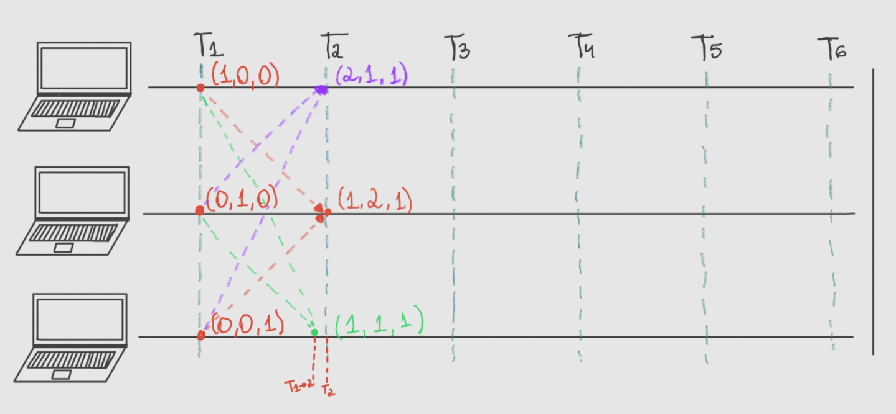
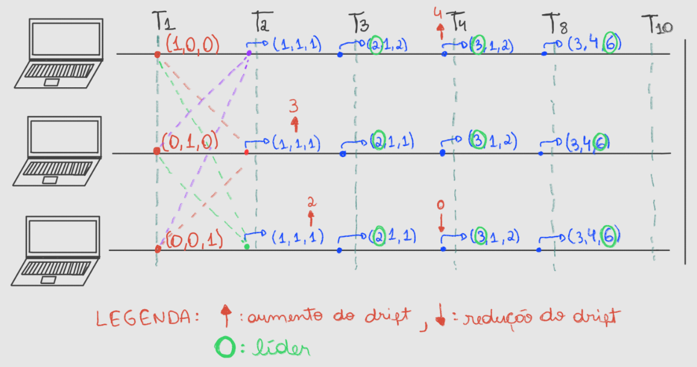
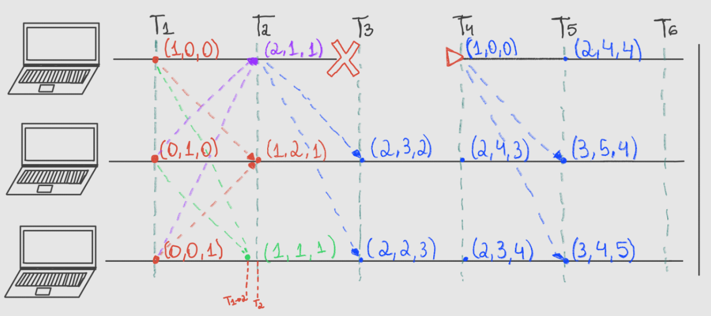

<h1 align="center">
  <br>
    
  <br>
  Sincronização de Relógios em Ambientes Distribuídos
  <br>
</h1>

<h4 align="center">Projeto da disciplina TEC 502 - Concorrência e Conectividade </h4>

<p align="center">
<div align="center">

[](https://github.com/nailasuely/distributed-time-sync/blob/main/LICENSE)


> Este relatório aborda a implementação de um sistema de sincronização de relógios em ambientes distribuídos utilizando relógios vetoriais. A solução é voltada para computadores conectados na mesma rede, permitindo que dispositivos se comuniquem entre si para ajustar seus relógios, que podem apresentar deriva (drift). O algoritmo utilizado foi o Relógio Vetorial, que permite o compartilhamento de um vetor com a quantidade de índices relacionado com a quantidade de dispositivos no sistema. Este projeto foi desenvolvido como parte dos estudos da disciplina de Concorrência e Conectividade na Universidade Estadual de Feira de Santana (UEFS).</p>

<p align="center">
  
## Download do repositório
```
gh repo clone nailasuely/distributed-time-sync
```

</div>


<details open="open">
<summary>Sumário</summary>

- [Introdução](#Introdução)
- [Tecnologias e Ferramentas Utilizadas](#Tecnologias-e-Ferramentas-Utilizadas)
- [Funcionalidades](#Funcionalidades)
- [Threads Necessárias](#Threads-necessárias)
- [Discussão sobre os requisitos](#Discussão-sobre-os-requisitos)
  - [Interface para gerênciamento](#Interface-para-gerênciamento-do-tempo-dos-relógios)
  - [Protocolo de comunicação](#Protocolo-de-comunicação)
  - [Sincronizaçao dos relógios](#Estratégia-para-sincronizaçao-dos-relógios)
  - [Eleição do relógio referência](#Estratégia-para-eleição-do-relógio-referência)
  - [Tratamento da confiabilidade](#Tratamento-da-confiabilidade)
  - [Tratamento da monotonicidade](#Tratamento-da-monotonicidade)
- [Como utilizar](#Como-utilizar)
- [Equipe](#equipe)
- [Tutor](#tutor)
- [Referências](#referências)
  
</details>


<div align="center">
   
</div>

# Introdução 

<p align="justify">Este relatório aborda a implementação de um sistema de sincronização de relógios em ambientes distribuídos utilizando relógios vetoriais. A solução é voltada para computadores conectados na mesma rede, permitindo que dispositivos se comuniquem entre si para ajustar seus relógios, que podem apresentar deriva (drift). O algoritmo utilizado foi o Relógio Vetorial, que permite o compartilhamento de um vetor com a quantidade de índices relacionado com a quantidade de dispositivos no sistema. Este projeto foi desenvolvido como parte dos estudos da disciplina de Concorrência e Conectividade na Universidade Estadual de Feira de Santana (UEFS).</p>

## Tecnologias e Ferramentas Utilizadas
- **Python:** Linguagem de programação. 
- **Flask:**  Framework web em Python usado para realizar a implementação a API RESTful.
- **Socket:** Módulo em Python utilizado para a comunicação de rede.
- **Threading:** Módulo em Python utilizado para implementar threads e permitir operações concorrentes.
- **JSON:** Formato de dados utilizado para troca de mensagens.
- **CORS** (Cross-Origin Resource Sharing): Extensão Flask  que é utilizada para permitir solicitações de diferentes origens para API.
- **Docker:** Ferramenta para empacotar e distribuir aplicativos em contêineres.
  


## Funcionalidades

- **Relógio Vetorial:** Implementa um mecanismo para manter a ordem de eventos em sistemas distribuídos.
- **Comunicação entre Processos:** Usa sockets para enviar e receber atualizações de relógio entre dispositivos.
- **Eleições de Líder:** O dispositivo com maior tempo se torna o novo líder, promovendo a sincronização dos relógios.
- **Drift Manual:** Permite a inserção manual de drift em cada dispositivo para simulações e testes.


## Estrutura do Código

O projeto é estruturado em três arquivos principais:

1. [**`main.py`**](https://github.com/nailasuely/distributed-time-sync/blob/main/clock/main.py): Contém a lógica principal do sistema, incluindo a comunicação entre processos e a eleição de líderes.
2. [**`vector_clock.py`**](https://github.com/nailasuely/distributed-time-sync/blob/main/clock/vector_clock.py): Define a classe `VectorClock`, que gerencia a lógica dos relógios vetoriais e suas operações.
3. [**`drift.py`**](https://github.com/nailasuely/distributed-time-sync/blob/main/clock/drift.py): Implementa a lógica para o gerenciamento do drift, permitindo que o tempo de tick seja ajustado dinamicamente.


## Threads Necessárias

O sistema utiliza quatro threads para garantir a operação correta:

1. **Thread de Drift:** Insere um atraso na contagem do relógio.
2. **Thread de Envio:** Envia o vetor de tempo para outros dispositivos.
3. **Thread de Recepção:** Recebe vetores de tempo de outros dispositivos.
4. **Thread de Contagem:** Serve como o contador que atualiza o vetor local.


## Discussão sobre os requisitos

### Interface para gerênciamento do tempo dos relógios

<p align="justify">No sistema em questão, a interface para ajustar o desvio (drift) dos relógios é projetada para operar de forma interativa via linha de comando ou pela interface (Figura 1). Para isso, é solicitado para usuáio para ele inserir um novo valor de desvio, que representa a quantidade de variação temporal em segundos. Esse valor é utilizado para fazer o ajuste do relógio local, permitindo ajustes que podem ocorrer a qualquer momento durante a execução do sistema e possibilita a simulação de diferentes condições de desvio.</p>

<div align="center">
   
    <p> Fig 1. Interface dos relógios</p>
</div>
<p align="justify">Para gerenciar essas alterações, o código faz uso de sockets, especificamente sockets TCP. O processo de ajuste do desvio é dividido em duas etapas principais. Primeiramente, um processo separado é encarregado de ler a entrada do usuário e atualizar o valor de desvio em um objeto denominado DriftEvent. Esse objeto é protegido por um bloqueio (lock) para garantir acesso seguro em um ambiente multithread. Em seguida, outro processo utiliza o valor atualizado do desvio para ajustar o intervalo de tempo entre os "ticks" do relógio. Esse gerenciamento é realizado através de uma thread que modifica o tempo de espera (sleep) com base no valor de desvio lido. Dessa forma, o relógio pode avançar mais rápido ou mais devagar conforme necessário. </p>

### Protocolo de comunicação

<p align="justify">O sistema usa o protocolo TCP (Transmission Control Protocol) para garantir a comunicação entre os processos distribuídos. O TCP é um protocolo de transporte que assegura que os dados sejam entregues de maneira ordenada e confiável entre os processos. Ele faz isso estabelecendo uma conexão entre o cliente e o servidor, garantindo que os pacotes de dados sejam recebidos corretamente e, se necessário, retransmitindo dados em caso de perda ou erro na transmissão.</p>


<p align="justify">A escolha do TCP é justificada pela necessidade de garantir a integridade e a ordem das mensagens trocadas entre os relógios distribuídos. No contexto de sincronização de relógios e atualização de vetores de tempo, é crucial que as mensagens sejam recebidas e que não ocorra perda de dados, para manter a consistência e precisão dos relógios. O TCP fornece uma comunicação confiável com controle de fluxo e correção de erros, aspectos que também são importantes que as atualizações de tempo e drift sejam transmitidas corretamente e que todos os processos mantenham uma visão consistente do estado do sistema. Utilizando TCP, o sistema minimiza o risco de inconsistências e falhas de comunicação que poderiam afetar a sincronização e o desempenho geral.</p>

### Estratégia para sincronizaçao dos relógios

<p align="justify">A estratégia para sincronização dos relógios no sistema distribuído é feita utilizando relógios vetoriais, uma técnica que é útil para manter a precisão temporal entre diferentes processos na rede. Cada processo no sistema possui um vetor de relógio, representado pela classe `VectorClock`, que mantém um vetor de contadores com o mesmo comprimento do número total de processos. Cada posição no vetor corresponde ao tempo local de um processo específico. Quando um evento ocorre em um processo, ele incrementa o valor correspondente em seu vetor. Para garantir a consistência entre os processos, os vetores de relógio são periodicamente trocados e atualizados.</p> 



<p align="justify">Para que todos os processos tenham a mesma visão do tempo, os vetores são trocados e atualizados regularmente. Isso é feito usando sockets TCP, no qual cada processo envia seu vetor atual para os outros e ajusta seu próprio vetor com base nas informações que recebe.</p>

<p align="justify">A sincronização é gerenciada pela atualização contínua dos vetores. A classe VectorClock tem um método chamado update(), que compara o vetor local com o vetor recebido e ajusta seus valores para refletir o maior valor conhecido em cada posição. Isso assegura que todos os vetores estejam em sincronia, mesmo que os relógios individuais avancem a diferentes ritmos por conta do drift. Além disso, o código inclui uma funcionalidade de eleição de líder que permite escolher um novo relógio de referência em caso de falha do atual líder.</p> 


### Estratégia para eleição do relógio referência

<p align="justify">A eleição do relógio de referência no sistema é projetada para fazer com que sempre haja um líder confiável servindo como a principal fonte de tempo para os outros processos. A estratégia envolve a comparação periódica dos vetores de relógio de todos os processos na rede. Cada processo mantém um vetor de relógio atualizado com base nas mensagens recebidas de outros processos, o que permite uma visão global do estado temporal do sistema.</p>

<p align="justify">A função elect_leader() é responsável pela eleição do líder. Ela compara os vetores de relógio de todos os processos e determina qual processo tem o maior valor em seu vetor. O processo com o maior valor é escolhido como líder, pois isso indica que ele tem a visão mais avançada do estado global. A eleição é feita periodicamente, e a função reavalia e exibe o líder atual a cada ciclo de envio de vetores. Dessa forma, se o líder falhar, o sistema pode rapidamente eleger um novo líder com base na informação mais recente dos vetores de relógio.</p>




### Tratamento da confiabilidade

<p align="justify">A reconexão de um relógio é feita pir meio da atualização periódica dos vetores de relógio entre os processos. Cada processo executa a função start_server, que está configurada para ouvir e aceitar conexões de outros processos.  Quando um relógio que estava desconectado volta a se conectar, ele envia seu vetor de relógio mais recente para os outros processos. Esse vetor é então incorporado ao sistema através da função update, que ajusta o vetor do processo que recebeu as informações, garantindo que ele saiba os valores mais recentes. Assim, o vetor do relógio reconectado é atualizado com o maior valor conhecido, o que evita retrocessos de tempo e ajuda a integrá-lo novamente ao sistema sem problemas.</p>



<p align="justify">Durante o período em que um relógio está desconectado, ele pode perder temporariamente sua posição de líder. Mas, quando ele se reconectar, ele retoma seu papel normal de envio e recebimento de vetores de relógio. A função de eleição de líder, elect_leader, garante que o sistema reavalie quem deve ser o líder após a reconexão. Isso assegura que a nova situação do relógio reconectado seja devidamente considerada na decisão sobre quem deve liderar o sistema.</p>

### Tratamento da monotonicidade

<p align="justify">Para que não ocorra erro na monotocidade, a estrutura `VectorClock` é projetada para fazer com que a monotonicidade dos tempos seja mantida ao atualizar os vetores de relógio entre os processos. Cada processo possui um vetor de relógio que é atualizado sempre que recebe uma mensagem de outro processo. O método update da classe VectorClock é crucial para esse processo, pois ajusta o vetor local para refletir os valores máximos observados nas mensagens recebidas.</p>

<p align="justify">A lógica por trás desse ajuste é simples: o sistema adota o maior valor entre o vetor local e o vetor recebido. Se o vetor recebido contém valores mais altos do que o vetor local, o vetor local é atualizado para refletir esses valores maiores. Isso evita que o tempo de um processo retroceda em relação ao tempo de qualquer outro processo no sistema, assegurando que a monotonicidade seja preservada.</p>

<p align="justify">E também, a função manage_drift ajusta o tempo do relógio local com base em um valor de drift, mas ainda respeita a lógica de "máximo" na atualização dos vetores entre processos. Assim, mesmo com variações de drift, as atualizações de vetores e mensagens de tempo são gerenciadas para garantir que o tempo global não retroceda e que todas as operações mantenham a ordem temporal correta. Isso é fundamental para garantir que o sistema permaneça coeso e preciso, mesmo diante de possíveis falhas temporárias ou variações nos relógios.</p>


## Algoritmo Utilizado

<p align="justify">O projeto utiliza o algoritmo de relógios vetoriais para resolver o problema de sincronização de tempo em sistemas distribuídos.</p>

<p align="justify">Cada processo possui um vetor que mantém o estado de seus próprios eventos e os eventos de outros processos. O vetor tem um tamanho igual ao número total de processos, e cada posição do vetor representa o tempo de um processo específico. Este vetor é constantemente atualizado para refletir os eventos locais e os recebidos de outros processos. Sempre que um evento ocorre em um processo, ele incrementa seu próprio contador no vetor. Este incremento garante que o tempo local do processo seja sempre atualizado em relação ao próprio processamento.</p>

<p align="justify">Ao enviar uma mensagem, um processo envia seu vetor de relógio. Quando um processo recebe uma mensagem, ele atualiza seu próprio vetor tomando o valor máximo entre seu vetor atual e o vetor recebido. Essa atualização é crucial para manter a consistência temporal entre os processos. O algoritmo permite a eleição de um líder com base no valor máximo do vetor. O processo que tiver o maior valor no vetor se torna o novo líder, e os outros processos ajustam seus relógios de acordo. Essa eleição é periódica e garante que sempre haja um relógio de referência confiável.</p>

<p align="justify">Os relógios vetoriais garantem que todos os processos tenham uma visão consistente da ordem dos eventos, mesmo que ocorram em paralelo. Isso é vital para a integridade do sistema, pois evita ambiguidades na sequência dos eventos. O algoritmo permite detectar e resolver conflitos entre operações simultâneas, proporcionando uma lógica clara de causalidade. Isso significa que é possível determinar qual evento ocorreu antes de outro, mesmo em um ambiente distribuído.</p>

<p align="justify">O uso de comunicação assíncrona entre processos permite que o sistema opere de forma robusta, mesmo na presença de falhas ou atrasos na rede. A capacidade de atualizar e ajustar continuamente os vetores de relógio torna o sistema resiliente a desconexões temporárias e outros problemas de rede. Em resumo, o algoritmo de relógios vetoriais resolve o problema de sincronização em sistemas distribuídos ao fornecer uma maneira eficiente de rastrear e comunicar o tempo entre processos, garantindo a consistência e a ordem correta dos eventos. Isso é essencial para manter a integridade e a confiabilidade do sistema, especialmente em ambientes onde a precisão temporal é crucial.</p>


<div align="center">
   
</div>


## Como utilizar

Para executar o relógio usando o docker, siga os passos abaixo:

1. Clone o repositório:
   ```bash
   git clone https://github.com/seu-usuario/distributed-time-sync.git
   cd distributed-time-sync
    ```

2. Execute o Dockerfile:
   ```bash
   cd clock
   docker build -t time-sync .
   docker run --network='host' -it --name container-time-sync time-sync
    ```
   
Para executar o interface:

1. Execute o Dockerfile:
   ```bash
   cd distributed-time-sync 
   docker-compose up --build
   ```
   - Antes, não esqueça de definir o IP em `components`.


## Equipe

- Naila Suele
- Douglas de Jesus

## Tutores

- Elinaldo Santos de Gois Junior


## Referências 
> - [1] Python Software Foundation. "threading — Thread-based parallelism." Python 3.12.3 documentation. https://docs.python.org/3/library/threading.html. Acessado em 2024.
> - [2] Python Software Foundation. "socket — Low-level networking interface." Python 3.12.3 documentation. https://docs.python.org/3/library/socket.html. Acessado em 2024.
> - [3] Pallets Projects. "Flask Documentation (3.0.x)." Flask. https://flask.palletsprojects.com/en/3.0.x/api/. Acessado em 2024.
> - [6] Fabricio Veronez. "Docker do zero ao compose: Parte 01." Transmitido ao vivo em 24 de março de 2022.Youtube, https://www.youtube.com/watch?v=GkMJJkWRgBQ&t=2s. Acessado em 2024 
